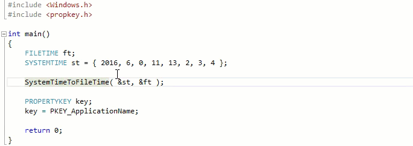

# Dave's Visual Studio Debugger Visualizer
This is an enhanced version of the CppCustomVisualizer in the [Microsoft Concord Extensibility Sample](https://github.com/Microsoft/ConcordExtensibilitySamples/wiki/Cpp-Custom-Visualizer-Sample). It currently supports the following Windows types:

#### FILETIME  
Displays both UTC & local time in the current locale format.  

#### SYSTEMTIME  
Displays the literal time in the current locale format.  

#### PROPERTYKEY  
Displays the key's canonical and display names.    

Variables of these types are normally displayed in the debugger in raw number form, but as you can see in the following example, with this extension they're displayed in more useful forms:

### Original project on which this is based
The original CppCustomVisualizer only handles the FILETIME type, and only shows a local format of it.

More information can be found in the [Wiki for that project](https://github.com/Microsoft/ConcordExtensibilitySamples/wiki/Cpp-Custom-Visualizer-Sample).

Natvis documentation can be found on [docs.microsoft.com](https://docs.microsoft.com/en-us/visualstudio/debugger/create-custom-views-of-native-objects).

## Notes on Changes to the Original example
### dll folder

#### _EntryPoint.cpp  
Defined new GUIDs for the 3 type visualizers & calls the appropriate converter when the matching GUID is passed (*from the debugger*).

#### FileAndSystemTimeViz.cpp/.h  
Converter for FILETIME & SYSTEMTIME -> String

#### PropertyKeyViz.cpp/.h  
Converter for PROPERTYKEY -> String

### TargetApp folder  
Revised application to illustrate the types handled by this extension.

