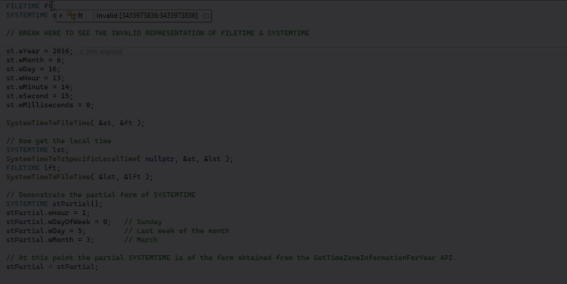
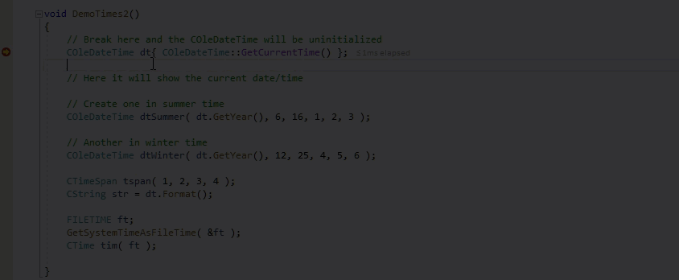
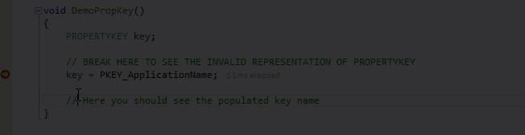
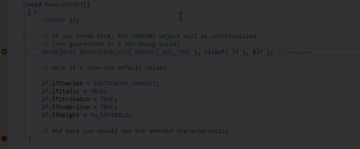

# Dave's Visual Studio Debug Visualizers
Win32, ATL, & MFC Debug Visualizers for the following structures and classes:

**Times:**  FILETIME, SYSTEMTIME, COleDateTime, CTime, CTimeSpan

**Miscellaneous:** PROPERTYKEY, LOGFONT
***
*If you'd like to see other common structures or classes included, don't hesitate to ask by adding a [new idea in the discussion area](https://github.com/Dave-Lowndes/DavesVisualStudioVisualizers/discussions/new).*
***
Variables of the following types are normally displayed in raw forms by the debugger, but as you can see in the following examples, with this extension they're displayed in more useful formats.

#### FILETIME, SYSTEMTIME
Displays the time value interpreted as both UTC and local time, shown in your current locale format. Also displays the SYSTEMTIME form used in <a href="https://docs.microsoft.com/en-us/windows/win32/api/timezoneapi/ns-timezoneapi-time_zone_information" target="_blank">TIME_ZONE_INFORMATION & DYNAMIC_TIME_ZONE_INFORMATION</a> from the <a href="https://docs.microsoft.com/en-us/windows/win32/api/timezoneapi/nf-timezoneapi-gettimezoneinformation" target="_blank">GetTimeZoneInformation(ForYear) & GetDynamicTimeZoneInformation</a> APIs.

***
#### COleDateTime, CTime, CTimeSpan
COleDateTime and CTime show the same format as FILETIME and SYSTEMTIME above.  
CTimeSpan shows the time value as Days, Hours, Minutes, and Seconds.

***
#### PROPERTYKEY  
Displays the key's canonical and display names.    

***
#### LOGFONT(A/W)
Displays the commonly used LOGFONT structure members in an easy to interpret format.

***
### Original Project
This project is  based on the CppCustomVisualizer in the [Microsoft Concord Extensibility Sample](https://github.com/Microsoft/ConcordExtensibilitySamples/wiki/Cpp-Custom-Visualizer-Sample).
The original visualizer only handles the FILETIME type, and only shows a local format of it.

Natvis documentation can be found on [docs.microsoft.com](https://docs.microsoft.com/en-us/visualstudio/debugger/create-custom-views-of-native-objects).

Thanks to [Gregg Miskelly](https://github.com/gregg-miskelly) for pointing me in the right direction in getting this project to build for Visual Studio 2022.

## Notes on additions to the original example
### dll folder

#### _EntryPoint.cpp  
Defined new GUIDs for the type visualizers & calls the appropriate converter when the matching GUID is passed (*from the debugger*).

#### FileAndSystemTimeViz.cpp/.h  
Converter for FILETIME & SYSTEMTIME -> String

#### PropertyKeyViz.cpp/.h  
Converter for PROPERTYKEY -> String

#### FontInfoViz.cpp/.h
Converter for LOGFONT(A/W) -> String

#### TargetApp folder  
Revised application to illustrate the types handled by this extension.

